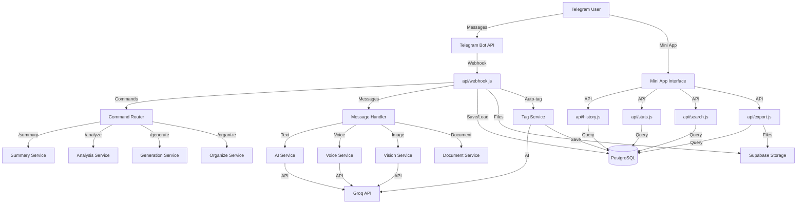
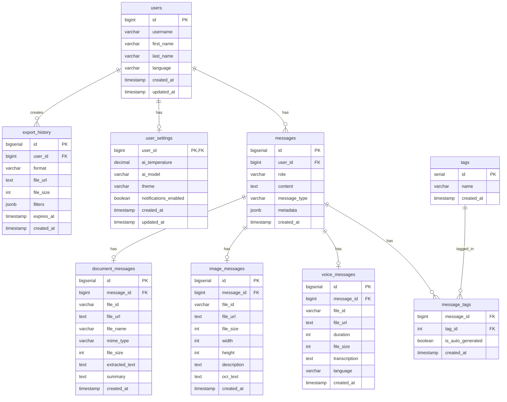
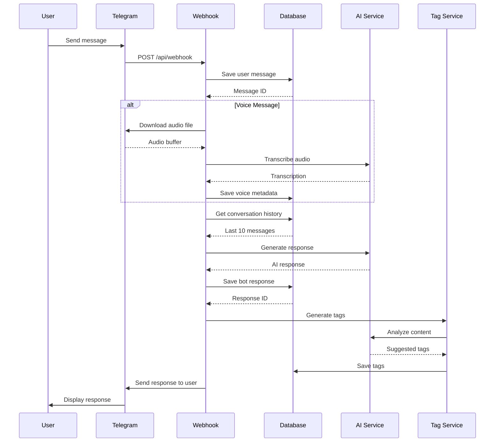
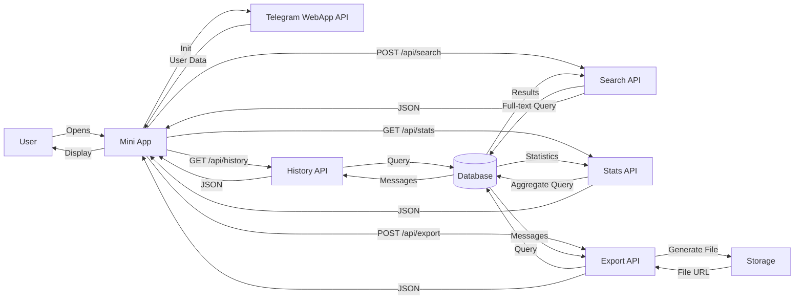
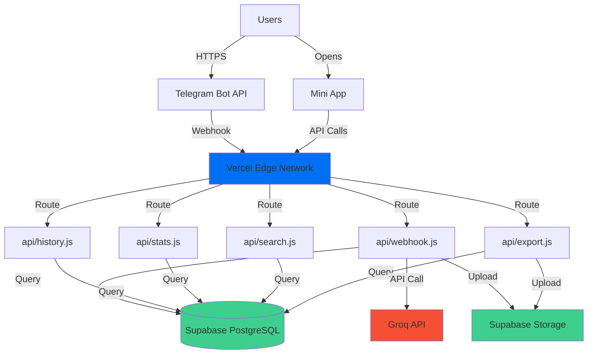

# Design Document: Felix Bot v4.0

## Overview

Felix Bot v4.0 представляет собой масштабное расширение существующего Telegram AI-ассистента версии 3.1. Текущая версия включает базовую функциональность обработки голосовых сообщений через Groq Whisper Large v3, контекстную память на основе in-memory хранилища (последние 10 сообщений), команду `/organize` для структурирования текста, и простой Mini App интерфейс.

Версия 4.0 добавляет:
- **Persistent Storage**: PostgreSQL через Supabase для хранения полной истории диалогов
- **Advanced Mini App**: Профессиональный веб-интерфейс с историей, поиском, статистикой и экспортом
- **Extended AI Commands**: `/summary`, `/analyze`, `/generate` для расширенной работы с контентом
- **Smart Features**: Автоматическая система тегирования, семантический поиск, настройки AI
- **Multimodal Support**: Обработка изображений и документов (PDF, DOCX)
- **Integrations**: Google Drive, Notion для экспорта данных

Дизайн фокусируется на P0 и P1 требованиях для первой версии v4.0, с архитектурой, позволяющей легко добавлять P2 и P3 функции в будущем.

### Design Goals

1. **Backward Compatibility**: Сохранить всю функциональность v3.1 без изменений в пользовательском опыте
2. **Scalability**: Архитектура должна поддерживать рост до 10,000+ пользователей
3. **Performance**: Все операции должны укладываться в Vercel Serverless timeout (10s Hobby, 60s Pro)
4. **Maintainability**: Модульная структура с четким разделением ответственности
5. **Cost Efficiency**: Оптимизация использования Groq API и Supabase Storage

### Technology Stack

- **Backend**: Node.js 18+, Vercel Serverless Functions
- **Database**: PostgreSQL 15+ (Supabase)
- **Storage**: Supabase Storage для файлов
- **AI**: Groq API (LLaMA 3.3 70B, Whisper Large v3)
- **Frontend**: Vanilla JavaScript, Telegram WebApp API
- **Testing**: Vitest для unit и property-based тестов

## Architecture

### High-Level Architecture



### Component Architecture

Система организована в модульную архитектуру с четким разделением ответственности:

**API Layer** (Vercel Serverless Functions):
- `api/webhook.js` - основной webhook для Telegram Bot API
- `api/history.js` - API для получения истории диалогов
- `api/stats.js` - API для статистики использования
- `api/search.js` - API для поиска по истории
- `api/export.js` - API для экспорта данных
- `api/settings.js` - API для управления настройками

**Service Layer** (lib/):
- `lib/ai.js` - AI сервис (chat, summary, analysis, generation)
- `lib/db.js` - Database сервис (CRUD операции)
- `lib/voice.js` - Voice сервис (transcription)
- `lib/vision.js` - Vision сервис (image recognition)
- `lib/document.js` - Document сервис (PDF/DOCX processing)
- `lib/tag.js` - Tag сервис (auto-tagging)
- `lib/search.js` - Search сервис (full-text + semantic)
- `lib/export.js` - Export сервис (TXT, JSON, PDF)
- `lib/storage.js` - Storage сервис (Supabase Storage wrapper)

**Frontend** (miniapp/):
- `miniapp/index.html` - основной Mini App интерфейс
- `miniapp/app.js` - логика приложения
- `miniapp/api.js` - API клиент
- `miniapp/styles.css` - стили

### Data Flow

**Message Processing Flow**:
1. User отправляет сообщение → Telegram Bot API
2. Telegram отправляет webhook → `api/webhook.js`
3. Webhook валидирует запрос и извлекает данные
4. Message сохраняется в DB через `lib/db.js`
5. Определяется тип сообщения (text/voice/image/document)
6. Соответствующий сервис обрабатывает сообщение
7. AI генерирует ответ через `lib/ai.js` → Groq API
8. Ответ сохраняется в DB
9. Tag Service автоматически генерирует теги
10. Ответ отправляется User через Telegram Bot API

**Mini App Data Flow**:
1. User открывает Mini App
2. Mini App инициализирует Telegram WebApp API
3. Получает user_id из Telegram
4. Загружает историю через `api/history.js`
5. Отображает данные с infinite scroll
6. User взаимодействует (поиск, фильтры, экспорт)
7. API запросы к соответствующим endpoints
8. Данные обновляются в реальном времени

## Components and Interfaces

### API Endpoints

#### POST /api/webhook
Основной webhook для обработки сообщений от Telegram Bot API.

**Request Body**:
```typescript
{
  message?: {
    message_id: number;
    from: {
      id: number;
      username?: string;
      first_name: string;
      last_name?: string;
    };
    chat: {
      id: number;
      type: string;
    };
    text?: string;
    voice?: {
      file_id: string;
      duration: number;
      file_size: number;
    };
    photo?: Array<{
      file_id: string;
      file_size: number;
      width: number;
      height: number;
    }>;
    document?: {
      file_id: string;
      file_name: string;
      mime_type: string;
      file_size: number;
    };
  };
  callback_query?: {
    id: string;
    from: { id: number };
    message: { chat: { id: number } };
    data: string;
  };
}
```

**Response**:
```typescript
{
  ok: boolean;
  error?: string;
}
```

#### GET /api/history
Получение истории диалогов пользователя.

**Query Parameters**:
- `user_id` (required): number - ID пользователя Telegram
- `limit` (optional): number - количество сообщений (default: 50)
- `offset` (optional): number - смещение для пагинации (default: 0)
- `type` (optional): string - фильтр по типу (text|voice|image|document)
- `from_date` (optional): string - ISO дата начала
- `to_date` (optional): string - ISO дата окончания

**Response**:
```typescript
{
  messages: Array<{
    id: number;
    user_id: number;
    role: 'user' | 'assistant';
    content: string;
    message_type: 'text' | 'voice' | 'image' | 'document';
    metadata?: {
      tokens?: number;
      model?: string;
      latency?: number;
      file_id?: string;
      file_url?: string;
    };
    tags: string[];
    created_at: string;
  }>;
  total: number;
  has_more: boolean;
}
```

#### GET /api/stats
Получение статистики использования.

**Query Parameters**:
- `user_id` (required): number
- `period` (optional): 'day' | 'week' | 'month' | 'all' (default: 'all')

**Response**:
```typescript
{
  total_messages: number;
  by_type: {
    text: number;
    voice: number;
    image: number;
    document: number;
  };
  by_command: {
    organize: number;
    summary: number;
    analyze: number;
    generate: number;
  };
  total_tokens: number;
  avg_response_time: number;
  by_hour: Array<{ hour: number; count: number }>;
  by_day: Array<{ day: string; count: number }>;
  models_used: {
    [model: string]: number;
  };
  first_message: string;
  last_message: string;
}
```

#### POST /api/search
Поиск по истории диалогов.

**Request Body**:
```typescript
{
  user_id: number;
  query: string;
  filters?: {
    type?: 'text' | 'voice' | 'image' | 'document';
    tags?: string[];
    from_date?: string;
    to_date?: string;
  };
  search_type?: 'fulltext' | 'semantic';
  limit?: number;
  offset?: number;
}
```

**Response**:
```typescript
{
  results: Array<{
    id: number;
    content: string;
    role: 'user' | 'assistant';
    message_type: string;
    tags: string[];
    created_at: string;
    relevance_score: number;
    highlights?: string[];
  }>;
  total: number;
  has_more: boolean;
}
```

#### POST /api/export
Экспорт данных в различных форматах.

**Request Body**:
```typescript
{
  user_id: number;
  format: 'txt' | 'json' | 'pdf';
  filters?: {
    type?: string;
    tags?: string[];
    from_date?: string;
    to_date?: string;
  };
}
```

**Response**:
```typescript
{
  file_url: string;
  file_size: number;
  expires_at: string;
}
```

#### GET /api/settings
Получение настроек пользователя.

**Query Parameters**:
- `user_id` (required): number

**Response**:
```typescript
{
  user_id: number;
  language: 'ru' | 'en';
  ai_settings: {
    temperature: number;
    model: string;
  };
  preferences: {
    theme: 'light' | 'dark';
    notifications: boolean;
  };
}
```

#### PUT /api/settings
Обновление настроек пользователя.

**Request Body**:
```typescript
{
  user_id: number;
  language?: 'ru' | 'en';
  ai_settings?: {
    temperature?: number;
    model?: string;
  };
  preferences?: {
    theme?: 'light' | 'dark';
    notifications?: boolean;
  };
}
```

**Response**:
```typescript
{
  success: boolean;
  settings: { /* updated settings */ };
}
```

### Service Interfaces

#### AI Service (lib/ai.js)

```javascript
export const ai = {
  // Get chat response with context
  async getChatResponse(userMessage, history, settings) {
    // Returns: { content: string, tokens: number, model: string, latency: number }
  },
  
  // Create summary of messages
  async createSummary(messages, detailLevel) {
    // detailLevel: 'brief' | 'medium' | 'detailed'
    // Returns: { summary: string, tokens: number }
  },
  
  // Analyze text
  async analyzeText(text, analysisType) {
    // analysisType: 'sentiment' | 'keywords' | 'topics' | 'readability' | 'all'
    // Returns: { sentiment, keywords, topics, readability, language }
  },
  
  // Generate content
  async generateContent(prompt, contentType, options) {
    // contentType: 'article' | 'email' | 'social' | 'code' | 'ideas'
    // options: { length, tone }
    // Returns: { content: string, tokens: number }
  },
  
  // Generate tags
  async generateTags(content) {
    // Returns: string[] (1-5 tags)
  }
};
```

#### Database Service (lib/db.js)

```javascript
export const db = {
  // User operations
  async getOrCreateUser(telegramUser) {
    // Returns: User object
  },
  
  // Message operations
  async saveMessage(userId, role, content, messageType, metadata) {
    // Returns: Message object with id
  },
  
  async getHistory(userId, options) {
    // options: { limit, offset, type, fromDate, toDate }
    // Returns: { messages: Message[], total: number }
  },
  
  async searchMessages(userId, query, filters, searchType) {
    // Returns: { results: Message[], total: number }
  },
  
  // Tag operations
  async saveTags(messageId, tags) {
    // Returns: void
  },
  
  async getTagsForUser(userId) {
    // Returns: Array<{ tag: string, count: number }>
  },
  
  // Stats operations
  async getUserStats(userId, period) {
    // Returns: Stats object
  },
  
  // Settings operations
  async getUserSettings(userId) {
    // Returns: Settings object
  },
  
  async updateUserSettings(userId, settings) {
    // Returns: Updated settings
  }
};
```

#### Voice Service (lib/voice.js)

```javascript
export const voice = {
  // Download voice file from Telegram
  async downloadVoiceFile(fileId) {
    // Returns: Buffer
  },
  
  // Transcribe voice to text
  async transcribe(audioBuffer, language) {
    // Returns: { text: string, duration: number, language: string }
  },
  
  // Save voice message
  async saveVoiceMessage(userId, fileId, transcription, duration) {
    // Saves to Storage and DB
    // Returns: { fileUrl: string, messageId: number }
  }
};
```

#### Export Service (lib/export.js)

```javascript
export const exportService = {
  // Export to TXT
  async exportToTxt(messages) {
    // Returns: string (formatted text)
  },
  
  // Export to JSON
  async exportToJson(messages) {
    // Returns: string (JSON)
  },
  
  // Export to PDF
  async exportToPdf(messages) {
    // Returns: Buffer (PDF file)
  },
  
  // Upload export file to storage
  async uploadExport(userId, fileBuffer, format) {
    // Returns: { fileUrl: string, expiresAt: Date }
  }
};
```

#### Tag Service (lib/tag.js)

```javascript
export const tagService = {
  // Generate tags for message
  async generateTags(content) {
    // Uses AI to generate 1-5 semantic tags
    // Returns: string[]
  },
  
  // Extract keywords
  extractKeywords(content) {
    // Simple keyword extraction without AI
    // Returns: string[]
  },
  
  // Normalize tag
  normalizeTag(tag) {
    // Converts to lowercase, removes special chars
    // Returns: string
  }
};
```

#### Search Service (lib/search.js)

```javascript
export const searchService = {
  // Full-text search
  async fulltextSearch(userId, query, filters) {
    // Uses PostgreSQL full-text search
    // Returns: { results: Message[], total: number }
  },
  
  // Semantic search (future P2)
  async semanticSearch(userId, query, filters) {
    // Uses AI embeddings for semantic matching
    // Returns: { results: Message[], total: number }
  },
  
  // Highlight matches in content
  highlightMatches(content, query) {
    // Returns: string with <mark> tags
  }
};
```

## Data Models

### Database Schema

```sql
-- Users table
CREATE TABLE users (
  id BIGINT PRIMARY KEY,  -- Telegram user ID
  username VARCHAR(255),
  first_name VARCHAR(255) NOT NULL,
  last_name VARCHAR(255),
  language VARCHAR(10) DEFAULT 'ru',
  created_at TIMESTAMP DEFAULT NOW(),
  updated_at TIMESTAMP DEFAULT NOW()
);

-- Messages table
CREATE TABLE messages (
  id BIGSERIAL PRIMARY KEY,
  user_id BIGINT NOT NULL REFERENCES users(id) ON DELETE CASCADE,
  role VARCHAR(20) NOT NULL CHECK (role IN ('user', 'assistant')),
  content TEXT NOT NULL,
  message_type VARCHAR(20) NOT NULL CHECK (message_type IN ('text', 'voice', 'image', 'document')),
  metadata JSONB DEFAULT '{}',
  created_at TIMESTAMP DEFAULT NOW(),
  
  -- Indexes for performance
  INDEX idx_messages_user_id (user_id),
  INDEX idx_messages_created_at (created_at),
  INDEX idx_messages_type (message_type),
  INDEX idx_messages_user_created (user_id, created_at DESC)
);

-- Full-text search index
CREATE INDEX idx_messages_content_fts ON messages 
  USING GIN (to_tsvector('russian', content));

-- Tags table
CREATE TABLE tags (
  id SERIAL PRIMARY KEY,
  name VARCHAR(100) NOT NULL UNIQUE,
  created_at TIMESTAMP DEFAULT NOW()
);

-- Message tags junction table
CREATE TABLE message_tags (
  message_id BIGINT NOT NULL REFERENCES messages(id) ON DELETE CASCADE,
  tag_id INTEGER NOT NULL REFERENCES tags(id) ON DELETE CASCADE,
  is_auto_generated BOOLEAN DEFAULT true,
  created_at TIMESTAMP DEFAULT NOW(),
  
  PRIMARY KEY (message_id, tag_id),
  INDEX idx_message_tags_message (message_id),
  INDEX idx_message_tags_tag (tag_id)
);

-- User settings table
CREATE TABLE user_settings (
  user_id BIGINT PRIMARY KEY REFERENCES users(id) ON DELETE CASCADE,
  ai_temperature DECIMAL(3,2) DEFAULT 0.7 CHECK (ai_temperature >= 0 AND ai_temperature <= 2),
  ai_model VARCHAR(100) DEFAULT 'llama-3.3-70b-versatile',
  theme VARCHAR(20) DEFAULT 'dark' CHECK (theme IN ('light', 'dark')),
  notifications_enabled BOOLEAN DEFAULT true,
  created_at TIMESTAMP DEFAULT NOW(),
  updated_at TIMESTAMP DEFAULT NOW()
);

-- Voice messages table (metadata)
CREATE TABLE voice_messages (
  id BIGSERIAL PRIMARY KEY,
  message_id BIGINT NOT NULL REFERENCES messages(id) ON DELETE CASCADE,
  file_id VARCHAR(255) NOT NULL,
  file_url TEXT,
  duration INTEGER NOT NULL,
  file_size INTEGER,
  transcription TEXT NOT NULL,
  language VARCHAR(10),
  created_at TIMESTAMP DEFAULT NOW(),
  
  INDEX idx_voice_messages_message (message_id),
  INDEX idx_voice_messages_user (message_id, created_at DESC)
);

-- Image messages table (metadata)
CREATE TABLE image_messages (
  id BIGSERIAL PRIMARY KEY,
  message_id BIGINT NOT NULL REFERENCES messages(id) ON DELETE CASCADE,
  file_id VARCHAR(255) NOT NULL,
  file_url TEXT,
  file_size INTEGER,
  width INTEGER,
  height INTEGER,
  description TEXT,
  ocr_text TEXT,
  created_at TIMESTAMP DEFAULT NOW(),
  
  INDEX idx_image_messages_message (message_id)
);

-- Document messages table (metadata)
CREATE TABLE document_messages (
  id BIGSERIAL PRIMARY KEY,
  message_id BIGINT NOT NULL REFERENCES messages(id) ON DELETE CASCADE,
  file_id VARCHAR(255) NOT NULL,
  file_url TEXT,
  file_name VARCHAR(255) NOT NULL,
  mime_type VARCHAR(100),
  file_size INTEGER,
  extracted_text TEXT,
  summary TEXT,
  created_at TIMESTAMP DEFAULT NOW(),
  
  INDEX idx_document_messages_message (message_id)
);

-- Export history table
CREATE TABLE export_history (
  id BIGSERIAL PRIMARY KEY,
  user_id BIGINT NOT NULL REFERENCES users(id) ON DELETE CASCADE,
  format VARCHAR(10) NOT NULL CHECK (format IN ('txt', 'json', 'pdf')),
  file_url TEXT NOT NULL,
  file_size INTEGER,
  filters JSONB,
  expires_at TIMESTAMP NOT NULL,
  created_at TIMESTAMP DEFAULT NOW(),
  
  INDEX idx_export_history_user (user_id, created_at DESC)
);

-- Usage stats materialized view (for performance)
CREATE MATERIALIZED VIEW user_stats AS
SELECT 
  user_id,
  COUNT(*) as total_messages,
  COUNT(CASE WHEN role = 'user' THEN 1 END) as user_messages,
  COUNT(CASE WHEN role = 'assistant' THEN 1 END) as bot_messages,
  COUNT(CASE WHEN message_type = 'text' THEN 1 END) as text_messages,
  COUNT(CASE WHEN message_type = 'voice' THEN 1 END) as voice_messages,
  COUNT(CASE WHEN message_type = 'image' THEN 1 END) as image_messages,
  COUNT(CASE WHEN message_type = 'document' THEN 1 END) as document_messages,
  SUM((metadata->>'tokens')::int) FILTER (WHERE metadata->>'tokens' IS NOT NULL) as total_tokens,
  AVG((metadata->>'latency')::int) FILTER (WHERE metadata->>'latency' IS NOT NULL) as avg_latency,
  MIN(created_at) as first_message_at,
  MAX(created_at) as last_message_at
FROM messages
GROUP BY user_id;

-- Refresh stats view periodically
CREATE INDEX idx_user_stats_user ON user_stats(user_id);
```

### Storage Structure

Supabase Storage организован в buckets:

```
felix-bot-storage/
├── voices/
│   └── {user_id}/
│       └── {message_id}_{timestamp}.ogg
├── images/
│   └── {user_id}/
│       └── {message_id}_{timestamp}.jpg
├── documents/
│   └── {user_id}/
│       └── {message_id}_{filename}
└── exports/
    └── {user_id}/
        └── {export_id}_{timestamp}.{format}
```

**Storage Policies**:
- Voice files: 90 days retention
- Image files: 30 days retention
- Document files: 30 days retention
- Export files: 7 days retention


## Correctness Properties

*A property is a characteristic or behavior that should hold true across all valid executions of a system—essentially, a formal statement about what the system should do. Properties serve as the bridge between human-readable specifications and machine-verifiable correctness guarantees.*

### Property Reflection

After analyzing all acceptance criteria, I identified several areas of redundancy:

1. **Save/Retrieve Properties**: Multiple requirements (1.1, 1.2, 2.2, 5.6, 7.6, 8.4) test saving data to database. These can be consolidated into comprehensive save properties.

2. **Filtering Properties**: Requirements 4.4, 4.5, 4.6, 9.4, 9.5 all test filtering by different criteria. These can be combined into a general filtering property.

3. **Metadata Presence**: Requirements 1.3, 2.3 test metadata presence. These can be combined into one property about metadata completeness.

4. **Counting/Analytics**: Requirements 3.1, 3.2, 3.5, 3.6, 3.7 all test counting accuracy. These can be consolidated into fewer comprehensive counting properties.

5. **Round-Trip Properties**: Requirements 1.8, 4.9, 10.9, 20.4 are all round-trip properties that can be clearly identified as such.

The following properties represent the unique, non-redundant correctness guarantees for the system:

### Property 1: Database Round-Trip Preservation

*For any* message with content, metadata, and message type, saving to the database then retrieving it should return a message with identical content, metadata, and message type.

**Validates: Requirements 1.8**

### Property 2: Message Chronological Ordering

*For any* set of messages for a user, retrieving history should return messages in chronological order (oldest to newest or newest to oldest as specified), maintaining the exact order they were created.

**Validates: Requirements 1.4**

### Property 3: User Data Isolation

*For any* two different users, querying messages for user A should never return messages belonging to user B, ensuring complete data isolation.

**Validates: Requirements 1.5**

### Property 4: Message-Response Linking

*For any* user message that receives a bot response, the response should be linked to the original message through a relationship that can be queried bidirectionally.

**Validates: Requirements 1.2**

### Property 5: Metadata Completeness

*For any* saved message, the message should have metadata containing at minimum: tokens (if AI-generated), model (if AI-generated), timestamp, and message_type.

**Validates: Requirements 1.3, 2.3**

### Property 6: Transaction Atomicity

*For any* set of related messages (user message + bot response), either all messages are saved successfully or none are saved, maintaining database consistency.

**Validates: Requirements 1.7**

### Property 7: Voice File Storage Persistence

*For any* voice message, the audio file should be stored in Storage_Service and a valid URL should be retrievable for at least 90 days after upload.

**Validates: Requirements 2.1, 2.5**

### Property 8: Voice Transcription Linking

*For any* voice message, the database should contain both the transcription text and a link to the audio file, allowing retrieval of both.

**Validates: Requirements 2.2, 2.4**

### Property 9: Voice File Size Validation

*For any* voice message, the audio file size should be less than 20MB (Telegram's limit), rejecting larger files with an appropriate error.

**Validates: Requirements 2.7**

### Property 10: Analytics Sum Invariant

*For any* user's statistics, the sum of message counts by type (text + voice + image + document) should equal the total message count.

**Validates: Requirements 3.8**

### Property 11: Analytics Period Filtering

*For any* time period (day, week, month), the statistics returned should only include messages with timestamps within that period.

**Validates: Requirements 3.4**

### Property 12: Token Sum Accuracy

*For any* user, the total tokens in analytics should equal the sum of tokens from all individual messages with token metadata.

**Validates: Requirements 3.2**

### Property 13: Export Filtering Correctness

*For any* export request with filters (date range, message type, tags), the exported data should contain only messages matching all specified filters.

**Validates: Requirements 4.4, 4.5, 4.6**

### Property 14: Export Round-Trip Preservation

*For any* set of messages exported to JSON format, importing the JSON back should restore messages with identical content, metadata, and relationships.

**Validates: Requirements 4.9**

### Property 15: Export Chronological Order

*For any* export in TXT or PDF format, messages should appear in chronological order matching the database order.

**Validates: Requirements 4.1, 4.3**

### Property 16: Summary Compression

*For any* dialog summary, the token count of the summary should be less than the total token count of the input messages being summarized.

**Validates: Requirements 5.8**

### Property 17: Summary Message Selection

*For any* /summary command with parameter N, exactly N messages (or all available if fewer than N exist) should be analyzed, taken from the most recent messages.

**Validates: Requirements 5.1**

### Property 18: Analysis Output Completeness

*For any* /analyze command, the response should contain all required fields: sentiment (with confidence score), keywords, topics, readability score, and detected language.

**Validates: Requirements 6.1, 6.2, 6.3, 6.4, 6.5**

### Property 19: Content Generation Parameter Application

*For any* /generate command with specified content type and tone, the generated content should reflect the requested type and tone in its structure and style.

**Validates: Requirements 7.2, 7.3, 7.5**

### Property 20: Tag Count Constraint

*For any* message that receives automatic tags, the number of tags should be between 1 and 5 inclusive.

**Validates: Requirements 8.2**

### Property 21: Tag Confidence Threshold

*For any* automatically generated tag, the confidence score should be greater than or equal to 0.6.

**Validates: Requirements 8.8**

### Property 22: Tag-Message Relationship Persistence

*For any* message with tags, querying the message should return all associated tags, and querying by tag should return all messages with that tag.

**Validates: Requirements 8.4**

### Property 23: Search Result Relevance Ordering

*For any* search query, results should be ordered by descending relevance score, where result[i].relevance >= result[i+1].relevance for all i.

**Validates: Requirements 9.10**

### Property 24: Search Filtering Correctness

*For any* search with filters (date, type, tags), results should only include messages matching all specified filters.

**Validates: Requirements 9.4, 9.5**

### Property 25: Search Pagination Consistency

*For any* search query with pagination, retrieving page 1 with limit 20 then page 2 with limit 20 should return different non-overlapping results, and the union should equal retrieving limit 40 with offset 0.

**Validates: Requirements 9.9**

### Property 26: Settings Persistence Round-Trip

*For any* user settings (temperature, model, theme, language), saving settings then retrieving them should return identical values.

**Validates: Requirements 11.5**

### Property 27: Settings Application to AI Requests

*For any* user with custom temperature setting, subsequent AI requests should use that temperature value instead of the default.

**Validates: Requirements 11.6**

### Property 28: Temperature Range Validation

*For any* temperature setting, the value should be between 0.0 and 2.0 inclusive, rejecting values outside this range.

**Validates: Requirements 11.2**

### Property 29: Language Response Matching

*For any* user message in a detected language (Russian or English), the AI response should be in the same language.

**Validates: Requirements 16.5, 16.7**

### Property 30: Language Preference Persistence

*For any* user's language preference, it should be saved to the database and applied to all subsequent interactions until changed.

**Validates: Requirements 16.6**

### Property 31: Config Parser Round-Trip

*For any* valid configuration object, parsing to JSON then pretty-printing then parsing again should produce an equivalent configuration object.

**Validates: Requirements 20.4**

### Property 32: Config Type Validation

*For any* configuration with invalid data types (e.g., string where number expected), the parser should reject it with a descriptive error indicating the field and expected type.

**Validates: Requirements 20.7**

### Property 33: Mini App LocalStorage Round-Trip

*For any* theme preference (light or dark), saving to localStorage then retrieving should return the same theme value.

**Validates: Requirements 10.9**

## Error Handling

### Error Categories

**Client Errors (4xx)**:
- Invalid input validation (400)
- Unauthorized access (401)
- Resource not found (404)
- Rate limiting (429)

**Server Errors (5xx)**:
- Database connection failures (503)
- AI API failures (502)
- Timeout errors (504)
- Internal server errors (500)

### Error Handling Strategy

**Graceful Degradation**:
1. If database is unavailable, fall back to in-memory storage with warning to user
2. If AI API fails, retry up to 3 times with exponential backoff
3. If storage service fails, save metadata without file and notify user
4. If export fails, offer alternative format or smaller date range

**Error Response Format**:
```typescript
{
  error: {
    code: string;           // Machine-readable error code
    message: string;        // Human-readable message (localized)
    details?: any;          // Additional context
    retry_after?: number;   // For rate limiting
  }
}
```

**Logging Strategy**:
- All errors logged to console with timestamp, user_id, and stack trace
- Critical errors (database, auth) trigger alerts
- User-facing errors localized to user's language
- Sensitive data (tokens, passwords) never logged

**Transaction Rollback**:
- Database transactions use BEGIN/COMMIT/ROLLBACK
- On error during multi-step operations, rollback all changes
- Maintain consistency: either all related data saved or none

**Timeout Handling**:
- AI requests: 30s timeout for chat, 45s for generation
- Database queries: 5s timeout with retry
- File uploads: 60s timeout
- Webhook responses: Must respond within 10s (Vercel limit)

### Specific Error Scenarios

**Voice Processing Errors**:
- File download fails → Retry 3 times, then notify user
- Transcription fails → Save audio file, mark transcription as failed
- File too large → Reject immediately with size limit message

**Export Errors**:
- File too large → Automatically split into multiple files
- Format conversion fails → Offer alternative format
- Storage upload fails → Retry with exponential backoff

**Search Errors**:
- Invalid query syntax → Return helpful error with examples
- No results found → Suggest alternative search terms
- Timeout → Return partial results with warning

**Integration Errors**:
- OAuth token expired → Prompt user to re-authenticate
- API rate limit → Queue request and notify user of delay
- Service unavailable → Fall back to local export

## Testing Strategy

### Dual Testing Approach

The testing strategy employs both unit tests and property-based tests to ensure comprehensive coverage:

**Unit Tests** focus on:
- Specific examples demonstrating correct behavior
- Edge cases (empty inputs, boundary values, special characters)
- Error conditions and exception handling
- Integration points between components
- Mocking external dependencies (Groq API, Telegram API, Supabase)

**Property-Based Tests** focus on:
- Universal properties that hold for all inputs
- Round-trip properties (save/load, export/import, parse/print)
- Invariants (ordering, sum constraints, data isolation)
- Comprehensive input coverage through randomization
- Relationship preservation across operations

### Property-Based Testing Configuration

**Framework**: fast-check (JavaScript property-based testing library)

**Configuration**:
- Minimum 100 iterations per property test
- Seed-based reproducibility for failed tests
- Shrinking enabled to find minimal failing examples
- Timeout: 30s per property test

**Test Tagging**: Each property test must include a comment referencing the design property:
```javascript
// Feature: felix-bot-v4-full-features, Property 1: Database Round-Trip Preservation
test('message save and load preserves data', async () => {
  await fc.assert(
    fc.asyncProperty(
      messageArbitrary,
      async (message) => {
        const saved = await db.saveMessage(message);
        const loaded = await db.getMessage(saved.id);
        expect(loaded).toEqual(message);
      }
    ),
    { numRuns: 100 }
  );
});
```

### Test Organization

```
tests/
├── unit/
│   ├── api/
│   │   ├── webhook.test.js
│   │   ├── history.test.js
│   │   ├── stats.test.js
│   │   ├── search.test.js
│   │   └── export.test.js
│   ├── lib/
│   │   ├── ai.test.js
│   │   ├── db.test.js
│   │   ├── voice.test.js
│   │   ├── tag.test.js
│   │   └── export.test.js
│   └── miniapp/
│       ├── api-client.test.js
│       └── storage.test.js
├── property/
│   ├── database.property.test.js
│   ├── analytics.property.test.js
│   ├── export.property.test.js
│   ├── search.property.test.js
│   ├── settings.property.test.js
│   └── config.property.test.js
├── integration/
│   ├── telegram-webhook.integration.test.js
│   ├── groq-api.integration.test.js
│   └── supabase.integration.test.js
└── fixtures/
    ├── messages.js
    ├── users.js
    └── arbitraries.js
```

### Test Coverage Goals

- Unit test coverage: 80%+ for all service layer code
- Property test coverage: 100% of identified correctness properties
- Integration test coverage: All external API interactions
- E2E test coverage: Critical user flows (send message, view history, export)

### Mocking Strategy

**External Services**:
- Groq API: Mock with predefined responses for deterministic tests
- Telegram API: Mock webhook payloads and bot API responses
- Supabase: Use test database with isolated schemas per test run

**Test Data**:
- Use factories for generating test objects
- Use arbitraries (fast-check) for property-based tests
- Maintain fixtures for common scenarios

### Continuous Integration

**Pre-commit**:
- Run unit tests
- Run linter (ESLint)
- Run type checker (if using TypeScript)

**CI Pipeline**:
1. Install dependencies
2. Run all unit tests
3. Run all property-based tests
4. Run integration tests (with test database)
5. Generate coverage report
6. Deploy to staging if all tests pass

**Test Database**:
- Separate Supabase project for testing
- Reset schema before each test run
- Seed with minimal test data

## Implementation Phases

### Phase 1: Core Infrastructure (P0) - Week 1-2

**Database Setup**:
- Create Supabase project
- Implement schema from design
- Create indexes for performance
- Set up connection pooling

**Basic API Endpoints**:
- Migrate webhook.js to use database
- Implement api/history.js
- Implement api/stats.js
- Update lib/db.js with all CRUD operations

**Testing**:
- Unit tests for database operations
- Property tests for round-trip and ordering
- Integration tests with test database

**Deliverables**:
- Working database with all tables
- Persistent message storage
- History API working in Mini App

### Phase 2: Advanced Features (P0/P1) - Week 3-4

**AI Commands**:
- Implement /summary command
- Implement /analyze command
- Implement /generate command
- Update lib/ai.js with new functions

**Search & Tags**:
- Implement auto-tagging service
- Implement full-text search
- Create api/search.js
- Add search UI to Mini App

**Export**:
- Implement export service (TXT, JSON, PDF)
- Create api/export.js
- Add export UI to Mini App

**Testing**:
- Unit tests for all new commands
- Property tests for search and export
- Integration tests for AI API

**Deliverables**:
- All P0 commands working
- Search functionality
- Export in all formats
- Auto-tagging system

### Phase 3: Settings & Polish (P1) - Week 5

**Settings**:
- Implement api/settings.js
- Add settings UI to Mini App
- Implement temperature control
- Add language switching

**Mini App Enhancements**:
- Improve UI/UX
- Add infinite scroll
- Add filters
- Add statistics dashboard

**Multilingual**:
- Add English translations
- Implement language detection
- Localize all messages

**Testing**:
- Unit tests for settings
- Property tests for language matching
- E2E tests for critical flows

**Deliverables**:
- Complete settings system
- Polished Mini App
- Full multilingual support

### Phase 4: Multimodal (P2) - Week 6-7

**Image Support**:
- Implement vision service
- Add image storage
- Create image analysis

**Document Support**:
- Implement document service
- Add PDF/DOCX parsing
- Create document analysis

**TTS**:
- Implement text-to-speech
- Add voice response option

**Testing**:
- Unit tests for multimodal services
- Integration tests with file storage

**Deliverables**:
- Image recognition working
- Document processing working
- TTS responses available

### Phase 5: Integrations (P2/P3) - Week 8+

**External Integrations**:
- Google Drive integration
- Notion integration
- Calendar reminders
- Webhook system

**Testing**:
- Integration tests with OAuth
- E2E tests for export flows

**Deliverables**:
- Working integrations
- Complete v4.0 feature set

## Deployment Strategy

### Environment Configuration

**Development**:
- Local Supabase instance or dev project
- Test Telegram bot
- Groq API test key
- Hot reload enabled

**Staging**:
- Staging Supabase project
- Staging Telegram bot
- Groq API production key
- Same configuration as production

**Production**:
- Production Supabase project
- Production Telegram bot
- Groq API production key
- Error monitoring enabled

### Environment Variables

```bash
# Telegram
TELEGRAM_BOT_TOKEN=<bot_token>

# Groq API
GROQ_API_KEY=<api_key>

# Supabase
DATABASE_URL=<postgres_connection_string>
SUPABASE_URL=<supabase_project_url>
SUPABASE_ANON_KEY=<anon_key>
SUPABASE_SERVICE_KEY=<service_role_key>

# Storage
STORAGE_BUCKET=felix-bot-storage

# App
NODE_ENV=production
APP_URL=https://felix-bot.vercel.app
```

### Deployment Process

**Vercel Deployment**:
1. Push to GitHub repository
2. Vercel auto-deploys on push to main
3. Run database migrations
4. Verify webhook is reachable
5. Test with staging bot

**Database Migrations**:
- Use Supabase migrations
- Version controlled in `database/migrations/`
- Applied automatically on deploy
- Rollback plan for each migration

**Rollback Strategy**:
- Keep previous deployment active
- Switch traffic back if issues detected
- Database migrations have down scripts
- Monitor error rates for 1 hour post-deploy

### Monitoring

**Metrics to Track**:
- API response times (p50, p95, p99)
- Error rates by endpoint
- Database query performance
- Groq API usage and costs
- Storage usage
- Active users

**Alerting**:
- Error rate > 5% → Immediate alert
- Response time > 10s → Warning
- Database connection failures → Critical alert
- Groq API rate limits → Warning

**Logging**:
- Structured JSON logs
- Include user_id, request_id, timestamp
- Log levels: ERROR, WARN, INFO, DEBUG
- Retain logs for 30 days

## Security Considerations

### Authentication & Authorization

**Telegram Authentication**:
- Validate webhook signature on every request
- Verify user_id from Telegram data
- No additional authentication needed (Telegram handles it)

**Mini App Authentication**:
- Use Telegram WebApp initData validation
- Verify hash signature
- Extract user_id from validated data

**API Security**:
- All endpoints validate user_id
- No cross-user data access
- Rate limiting per user

### Data Protection

**Encryption**:
- Database: Supabase provides encryption at rest
- In transit: All connections use TLS
- OAuth tokens: Encrypted before storage
- Sensitive metadata: Encrypted in JSONB fields

**Data Retention**:
- Messages: Indefinite (user can delete)
- Voice files: 90 days
- Image files: 30 days
- Document files: 30 days
- Export files: 7 days
- Logs: 30 days

**GDPR Compliance**:
- User can export all data
- User can delete all data (/delete_account command)
- Data processing consent in /start message
- Privacy policy link in bot description

### Rate Limiting

**Per User Limits**:
- Messages: 60 per minute
- API requests: 100 per minute
- Exports: 10 per hour
- Search queries: 30 per minute

**Global Limits**:
- Webhook: 1000 requests per second
- Database: Connection pool of 20
- Groq API: Respect API rate limits

**Implementation**:
- Use in-memory cache (Redis if needed)
- Return 429 with retry_after header
- Exponential backoff for retries

### Input Validation

**Message Content**:
- Max length: 4096 characters (Telegram limit)
- Sanitize HTML/markdown
- Check for malicious content

**File Uploads**:
- Validate file types
- Check file sizes
- Scan for malware (future enhancement)

**API Parameters**:
- Validate all query parameters
- Sanitize SQL inputs (use parameterized queries)
- Validate JSON payloads

## Performance Optimization

### Database Optimization

**Indexing Strategy**:
- Index on user_id + created_at for history queries
- Full-text search index on message content
- Index on tags for tag-based queries
- Composite indexes for common filter combinations

**Query Optimization**:
- Use EXPLAIN ANALYZE for slow queries
- Limit result sets with pagination
- Use materialized views for analytics
- Cache frequent queries

**Connection Pooling**:
- Pool size: 20 connections
- Idle timeout: 30 seconds
- Connection reuse
- Health checks

### Caching Strategy

**What to Cache**:
- User settings (5 minute TTL)
- Tag lists (10 minute TTL)
- Analytics (1 hour TTL)
- Search results (5 minute TTL)

**Cache Implementation**:
- In-memory cache for serverless functions
- Consider Redis for shared cache (if needed)
- Cache invalidation on updates

### API Performance

**Response Time Targets**:
- Webhook: < 1s for 95% of requests
- History API: < 500ms
- Search API: < 2s
- Export API: < 30s (async for large exports)
- Stats API: < 1s

**Optimization Techniques**:
- Lazy loading for Mini App
- Pagination for large result sets
- Streaming for large exports
- Parallel processing where possible

### Groq API Optimization

**Cost Reduction**:
- Cache common responses
- Use appropriate model for task (smaller models when possible)
- Batch requests when feasible
- Monitor token usage

**Performance**:
- Set appropriate max_tokens
- Use streaming for long responses
- Implement timeout and retry logic
- Monitor API latency

## Diagrams

### Database Entity Relationship Diagram



### Message Processing Sequence Diagram



### Mini App Data Flow Diagram



### Deployment Architecture Diagram



## Conclusion

This design document provides a comprehensive blueprint for Felix Bot v4.0, focusing on P0 and P1 requirements for the initial release. The architecture is modular, scalable, and maintainable, with clear separation of concerns and well-defined interfaces.

Key design decisions:
1. **PostgreSQL via Supabase** for reliable, scalable data persistence
2. **Modular service architecture** for easy testing and maintenance
3. **Property-based testing** for comprehensive correctness guarantees
4. **Graceful degradation** for robust error handling
5. **Phased implementation** for manageable development

The system is designed to handle 10,000+ users while maintaining sub-second response times for most operations. Security, performance, and user experience are prioritized throughout the design.

Next steps:
1. Review and approve this design document
2. Set up development environment (Supabase, test bot)
3. Begin Phase 1 implementation (Core Infrastructure)
4. Iterate based on testing and user feedback
